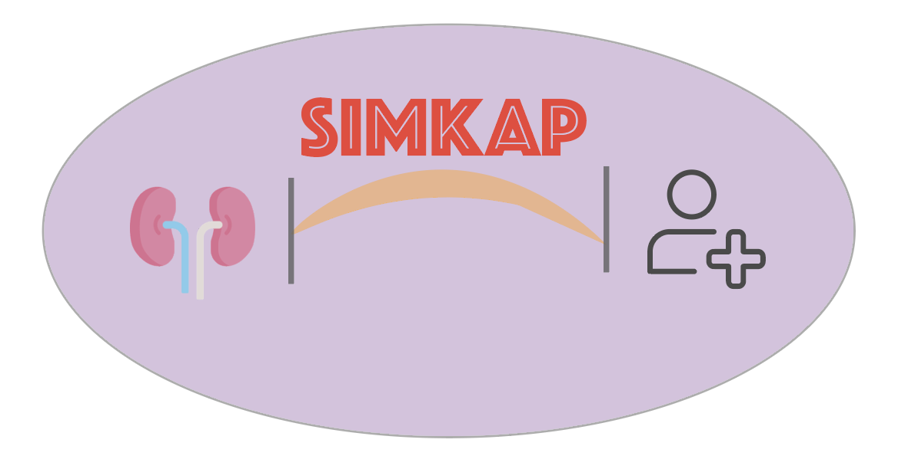

# simKAP: Kidney allocation simulation process package

<!-- badges: start -->





[](https://travis-ci.com/SydneyBioX/KidneyAllocation)
[](https://ci.appveyor.com/project/SydneyBioX/KidneyAllocation)
[](https://codecov.io/gh/SydneyBioX/KidneyAllocation?branch=master)
<!-- badges: end -->

The goal of simKAP is to …

## Installation

You can install the development version of `simKAP` from [GitHub](https://github.com/) with:

```
# install.packages("devtools")
devtools::install_github("SydneyBioX/simKAP")
```

## Reference

Please refer to our vignette for examples: https://sydneybiox.github.io/simKAP/.


